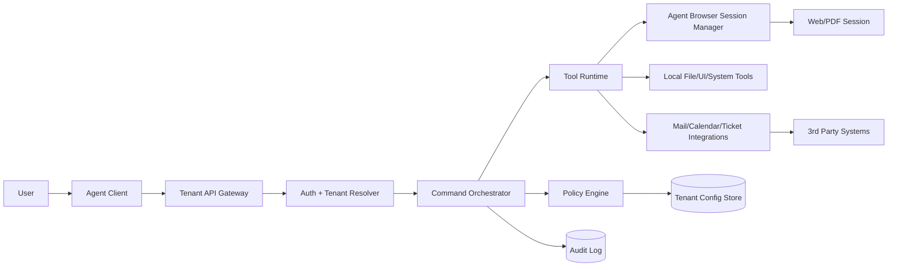

## Teknik Mimari

Bu dokuman, multi-tenant teknik destek platformunun hedef mimarisini ve ana veri akisini tanimlar.

### 1. Bilesenler
- Agent Client (Windows/Mac): UI, local tool runtime, session state.
- Tenant API Gateway: Auth ve tenant routing.
- Orchestrator: Komut parse, policy enforce, tool chain.
- Policy Engine: Tenant kurallari ve izinler.
- Agent Browser Session Manager: Kalici web/PDF oturumlari.
- Tool Runtime: File/UI/System/Mail/Calendar adaptorleri.
- Integrations: Ticketing, mail, calendar, storage.
- Data Store: Tenant, profile, audit log.

### 2. Akis Diyagrami

### 3. Veri Akisi (Ozet)
1. Kullanici komutu client tarafindan backend’e iletilir.
2. Orchestrator komutu parse eder ve tenant policy uygular.
3. Tool chain calisir; local araclar ve gerekirse agent browser oturumu kullanilir.
4. Sonuc client’a doner ve audit loga yazilir.

### 4. Session Stratejisi
- `Session Context`: Kullanicinin aktif isi.
- `Browser Context`: Kalici web/PDF session bilgisi.
- `Finish Semantics`:
  - `tamam` -> is biter, browser session devam edebilir.
  - `oturumu kapat` -> browser session kapatilir.

### 5. Multi-Tenant Izolasyon
- Auth token her istekte tenant ID tasir.
- Policy ve data tenant bazli ayrilir.
- Audit log tenant id ile yazilir.

### 6. Agent Browser MVP
- Playwright persistent context ile calisir.
- PDF acma ve link cikarma `pdfjs-dist` ile.
- Web/Gmail/Calendar ayni session icinde reuse edilir.
